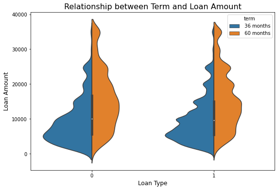
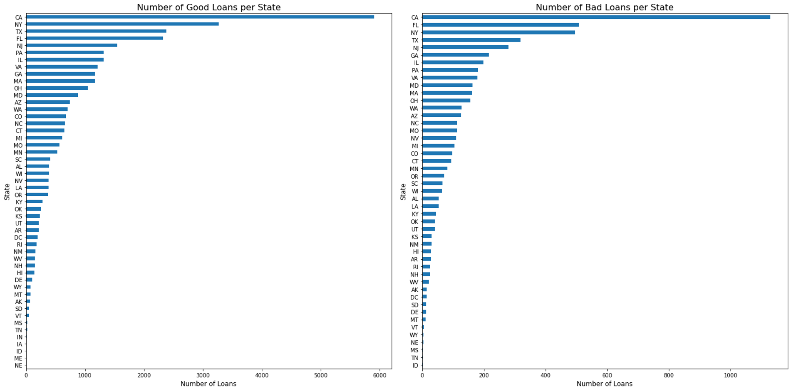
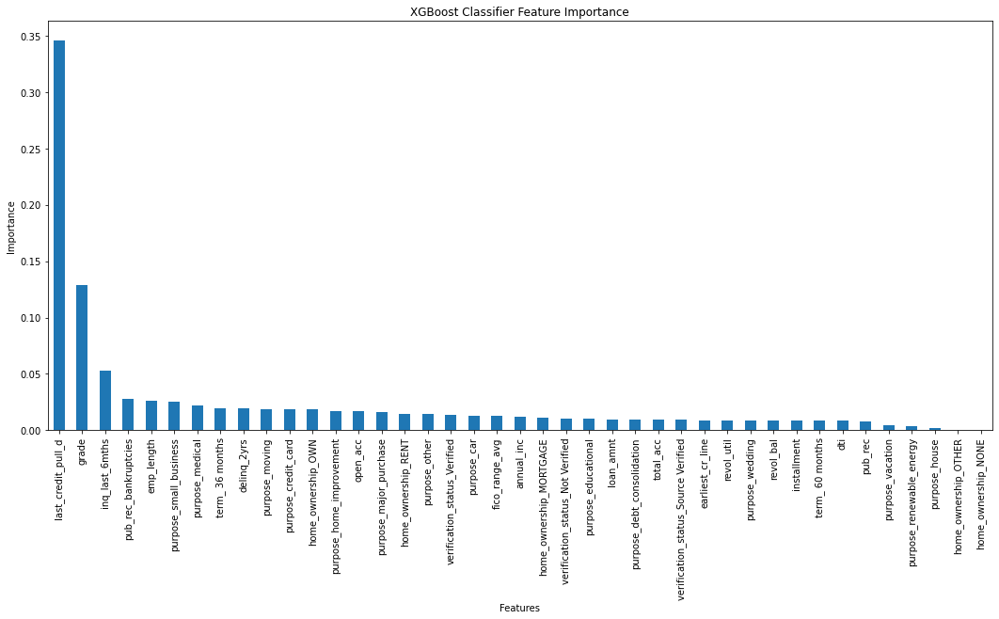

## Data Information

* **Lending Club Loan Data 2007-2011** containing loan status and relevant financial information.
* **42,538** entries, **115** features
* Target feature (**loan_status**) reclassified/binarized as **loan_type**.

  * **1** (Good Loan): Fully Paid
  * **0** (Bad Loan): Charged Off, Does Not Meet the Credit Policy

## Data Wrangling/Feature Engineering

1. Data Cleaning

   * Removed empty columns/null values.
2. Feature Selection

   * Eliminated redundancy/data leakage.
   * Retained relevant/useful features.
3. Features Converted to Numerical Data Type

   * Feature containing numerical values

     * **revol_util**: revolving line utilization rate.
   * Features containing ordinal values

     * **grade**: loan grade assigned by Lending Club.
     * **emp_length**: employment length in years.
4. Newly Added Feature

   * **fico_range_avg**: mean value of **fico_range_low** and **fico_range_high**.
5. Target Feature Engineering

   * Excluded loans in-progress.
   * Target feature reclassified into two groups (Good Loan, Bad Loan), then binarized.

## Exploratory Data Analysis

### Pearson Correlations

* Notable **loan_type** correlations 

  * **grade**: loan grade assigned by Lending Club.
  * **fico_range_avg**: mean value of **fico_range_low** and **fico_range_high**.
  * **revol_util**: revolving line utilization rate.
  * **inq_last_6mths**: the number of inquiries in past 6 months (excluding auto and mortgage inquiries).

### Term/Loan Amount

* Loan amount tends to increase with longer term regardless of loan type.

### Influence of Applicant Location

* States with highest # of good loans ≈ States with highest # of bad loans
* Applicant location (state) is not a good predictor for loan type.

### Loan Type Distribution

* Grade description: 0 as worst, 6 as best
* Ideally, the number of bad loans should decrease with higher grade.

## Modeling

### Overview

* Nature of task

  * Supervised learning
  * Binary classification of highly imbalanced data
* Machine learning tools used

  * **Scikit-Learn**
  * **Imbalanced-Learn**
  * **XGBoost**

### Procedure

I. Data Preprocessing

1. One-hot encoding on categorical features
2. Conversion of datetime objects to ordinal numeric
3. Training/Test split (**80%**: **20%**)
4. Standardization of features with **StandardScaler**
5. Minority class (Bad Loan) oversampling with **SMOTE** from **Imbalanced-Learn**

II. Hyperparameter Tuning with Randomized Search

* **Stratified K-Fold** with **cv = 5**
* **n_iter = 30**
* **scoring = 'roc_auc'**

III. Training with Tuned Hyperparameters

IV. Performance Evaluation

* Evaluation metric

  * **F1 scores**
  * **ROC AUC**
* Models trained and evaluated

  * **Logistic Regression**
  * **Random Forest**
  * **Support Vector Machine**
  * **XGBoost**

### Model Comparison

| Model                  | Minority F1 | Majority F1 | ROC AUC |
| ---------------------- | ----------- | ----------- | ------- |
| Logistic Regression    | 0.47        | 0.80        | 0.78    |
| Random Forest          | 0.53        | 0.91        | 0.74    |
| Support Vector Machine | 0.41        | 0.87        | 0.67    |
| XGBoost                | 0.56        | 0.89        | 0.80    |

* Best model: **XGBoost**

### Features of Importance

* Primary features of importance

  * **last_credit_pull_d**: the most recent month in which Lending Club pulled credit for this loan.
  * **grade**: loan grade assigned by Lending Club.
  * **inq_last_6mths**: the number of inquiries in past 6 months (excluding auto and mortgage inquiries).

## Assumptions/Limitations

* Assumption

  * Data collected from loan applicants is genuine.
* Limitations

  * Outdated data.
  * Large volume of missing features (only 24 out of 115 features usable).
  * Limited sample size (only 39,239 entries used).

## Conclusion

* Best model: **XGBoost**
* Primary features of importance: **last_credit_pull_d**, **grade**, **inq_last_6mths**
* Prospective improvements

  * Up-to-date dataset
  * Hyperparameter tuning with different techniques
  * Alternative classifier algorithms: **Neural Network**, **Deep Learning**, etc.
