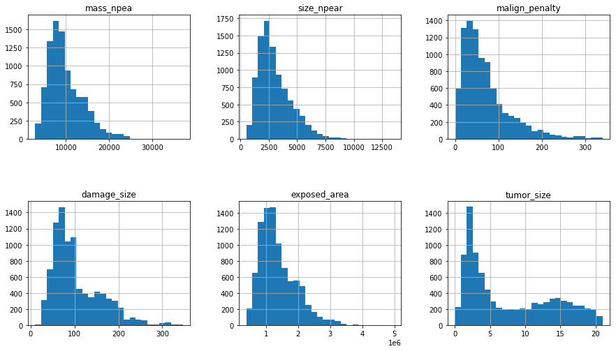
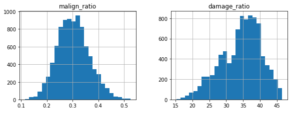
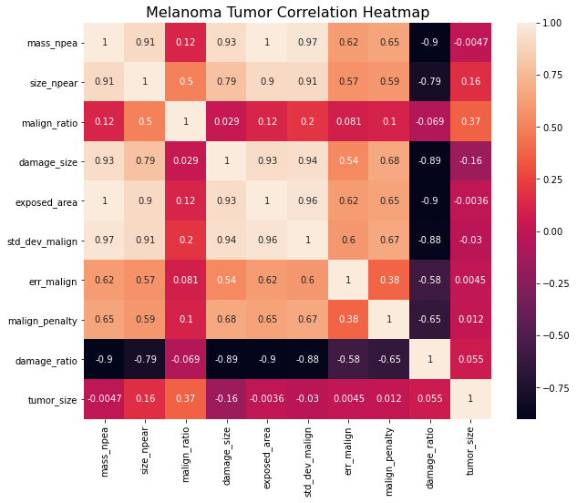

## Data Information

* Datasets provided by Machine Hack, containing tumor size and relevant attributes.
* **9,146** entries, **10** features
* **0** null values
* Features

  * **mass_npea**: the mass of the area under under study for melanoma tumor.
  * **size_npear**: the size of the area under study for melanoma tumor.
  * **malign_ratio**: the ratio of normal to malign surface under study.
  * **damage_size**: irrecoverable area of skin damaged by the tumor.
  * **exposed_area**: total area exposed to the tumor.
  * **stddevmalign**: standard deviation of malign skin measurements.
  * **err_malign**: error in malign skin measurements.
  * **malign_penalty**: penalty imposed due to measurement error in the lab.
  * **damage_ratio**: the ratio of damage to total spread on the skin.
  * **tumor_size**: size of melanoma tumor.

## Exploratory Data Analysis

### Distribution of Feature Values

* Apparent correlations most likely due to the inherent proportionality between size and mass.

* Mean of **malign_ratio** ≈ 0.3, indicating high prevalence of malignancy in the dataset.
* Left-skewed distribution of **damage_ratio** supports this notion.

### Pearson Correlations

* Notable **tumor_size** correlations

  * **size_npear**
  * **malign_ratio**
  * **damage_size**

## Modeling

### Overview

* Nature of task

  * Supervised learning
  * Regression to predict numerical value
* Machine learning tools used

  * Scikit-Learn
  * Keras

### Procedure

I. Data Preprocessing

1. Training/Validation Split (70%: 30%)
2. Standardization of features with **StandardScaler**.

II. Hyperparameter Tuning with Randomized Search

* **cv = 3**
* **n_iter = 50**
* **scoring = 'neg_mean_squared_error'**

III. Training with Tuned Hyperparameters

IV. Performance Evaluation

* Evaluation metric: R2, MSE